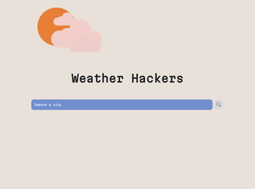
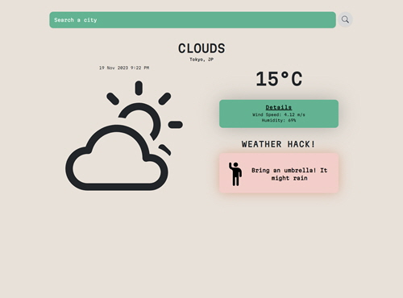
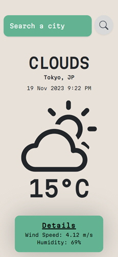

This repository was created as part of a one-week hackathon for [Coder Academy](https://coderacademy.edu.au/)'s full stack web development coding bootcamp.

# Hackathon

The Hackathon ran from 7 October 2023 to 13 October 2023.

## Overview

Created by:
- [Carmina Familar](https://github.com/CarminaF)
- [Emily Mehegan](https://github.com/e-mehegan)
- [Stephen Gow](https://github.com/StevieG46)
- [Helen Thai](https://github.com/hotteok219)

Our goal was to create an application that allowed users to search for a location and view the current weather details. The app would also return a weather hack depending on the conditions.

Features include:
- displaying a weather hack, depending on the weather condition
- displaying details around the wind speed and humidity
- the ability to toggle between Celsius and Fahrenheit by clicking on the temperature
- displaying the current date and time, depending on the location
- colour changes on the UI, depending on the weather condition.

The application uses a 3rd party API - [OpenWeather](https://openweathermap.org/).

You can view the deployed app at [weather-hack-app.netlify.app](https://weather-hack-app.netlify.app/).

## Tech stack

                              
          

## Screenshots

### Landing page

### Weather details

